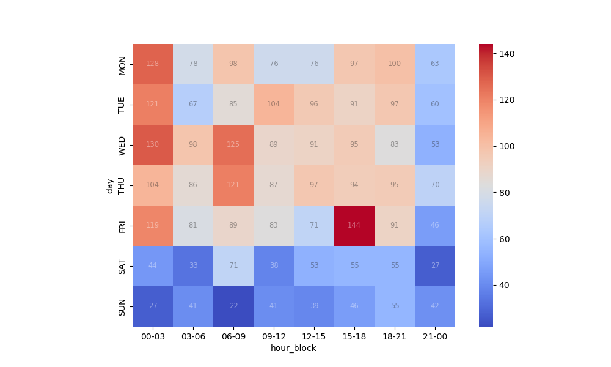

# commit_etl

## Assessment

For a particular repository, example Airflow (https://github.com/apache/airflow)
- pull in the commits  over the last 6 months. (plus points if this window of time can be varied) 

With the data ingested, address the follow queries: 
- For the ingested commits, determine the top 5 committers ranked by count of commits and  their number of commits. 
- For the ingested commits, determine the committer with the longest commit streak. 
- For the ingested commits, generate a heatmap of number of commits count by all users by day  of the week and by 3 hour blocks. 


## Solution

Here I am using Python for ETL process. This will authenticate and extract the commits from Github REST API, Transform or filter the required fields and load them to the local postgres database which is running inside a docker containter.

## GitHub REST API investigation

Though there was hint to use the `committer` object instead of `author`. upon investigating the result data, the `committer` object seems not relevant as it has the same value across different authors.  Below we can see the committer login is web-flow for all commits which is misleading. From gitlab docs, i learnt that this `web-flow` is the Git committer for all web commits (merge/revert/edit/etc...) made on GitHub.com. Hence, I used `author` object instead of the `committer`.

```
>>> rec_df.shape
(1569, 58)
>>> rec_df.head()
                                        sha                                            node_id                                                url  ... committer.type committer.site_admin author
0  9d5327806fac61cd62abd30a6339b0cb26ad1ebf  C_kwDOAgUK29oAKDlkNTMyNzgwNmZhYzYxY2Q2MmFiZDMw...  https://api.github.com/repos/apache/airflow/co...  ...           User                False    NaN
1  7faa72795185c1af4b21f207ce7e0735c4365d46  C_kwDOAgUK29oAKDdmYWE3Mjc5NTE4NWMxYWY0YjIxZjIw...  https://api.github.com/repos/apache/airflow/co...  ...           User                False    NaN
2  76c2ade2c63abc3677b8fcd59af6f8779b613be7  C_kwDOAgUK29oAKDc2YzJhZGUyYzYzYWJjMzY3N2I4ZmNk...  https://api.github.com/repos/apache/airflow/co...  ...           User                False    NaN
3  015fef31bb7f848b321d5287edeb6ff6ac63ab10  C_kwDOAgUK29oAKDAxNWZlZjMxYmI3Zjg0OGIzMjFkNTI4...  https://api.github.com/repos/apache/airflow/co...  ...           User                False    NaN
4  379bd80573e2c02810367ee28288e59a7af2ac10  C_kwDOAgUK29oAKDM3OWJkODA1NzNlMmMwMjgxMDM2N2Vl...  https://api.github.com/repos/apache/airflow/co...  ...           User                False    NaN

[5 rows x 58 columns]
>>> rec_df[['committer.login', 'committer.id']].drop_duplicates()
  committer.login  committer.id
0        web-flow      19864447

>>> rec_df[['commit.committer.name', 'commit.committer.email']].drop_duplicates()
  commit.committer.name commit.committer.email
0                GitHub     noreply@github.com
```


## Prerequisites

- [Mamba](https://mamba.readthedocs.io/en/latest/mamba-installation.html#mamba-install) A faster conda like environment manager used to create the python environment. 
- [Docker](https://docs.docker.com/engine/install/) for building the postgres database. 


## Installation

### Create the conda environment

you can create the conda environment using [env.yml](./env.yml) file

```
mamba env create -f env.yml -n gitapienv
mamba activate gitapienv
```

### Build Postgres docker image

Postgres docker image is built using [commitsdb.Dockerfile](./DB/commitsdb.Dockerfile) which initialise the table and view creation that are stored in [setup.sql](./DB/setup.sql). The sql creates two views within the database called `commits_view` and `commits_extended`. This `commits_extended` view contains the `Day`, `Hour` and `hour_block` columns which are calculated automatically when the data is populated into the main `commits` table and the view is invoked.

 _make sure to set/export the environmental variables declared in [.env](./.env) file_

```
cd DB
export ../.env
docker build -t githubdb -f commitsdb.Dockerfile . 
```

### Create Github personal token 

The GitHub REST API uses rate limiting to control API traffic. This is not mandatory but the requests with authenticated connection have higher rate limits compared to the general requests. Check this [token-github](https://docs.github.com/en/authentication/keeping-your-account-and-data-secure/managing-your-personal-access-tokens#creating-a-fine-grained-personal-access-token) link for more information. Once the token is created, save it as a environmental variable name `GITHUB_TOKEN`

```
export GITHUB_TOKEN='adceafaxxxxxx......'
# can save it to ~/.bashrc for more consistent usage
```

## Scripts

ETL:
 - [Github.py](./ETL/Github.py) used to create a GithubCommitExtractor class for connecting to Github via REST API and pull the commits 
 - [etl.py](./ETL/etl.py) The main script for Extracting the Commits, Transforming the records and Loading them to the PostgresDB

Database:
 - [setup.sql](./DB/setup.sql) used for creating the tables and required views. 
 - [commitsdb.Dockerfile](./DB/commitsdb.Dockerfile) Dockerfile used for building postgresDB. 

Environment:
 - [.env](./.env) dot file containing the environmental variables used for DB connection.

Queries:
 - [sql.py](./queries/sql.py) used for creating database class to connect and read from the postgres.
 - [analysis.py](./queries/analysis.py) contains the solutions for the three anlysis questions


## Implementation

### 1. Start the Postgres DB

```
# run the built docker image in detached mode
docker run -d --name gitpostgres --env-file ../.env -p 5432:5432 githubdb 

```

Check whether the container is running. If it is running, we can ssh into the running container to see the tables and records

```
docker ps 

```
should list the running container as below
```
CONTAINER ID   IMAGE      COMMAND                  CREATED         STATUS         PORTS                    NAMES
ad814f168826   githubdb   "docker-entrypoint.s…"   4 seconds ago   Up 4 seconds   0.0.0.0:5432->5432/tcp   gitpostgres
```

the tables and records can be listed as well. we should not see any records as we just created the table alone.
```
docker exec -it gitpostgres bash 

#once login inside, connect to psql 
psql -d github -U vamshi

#show the table records
select * from commits;

```
desired output:
```
root@ad814f168826:/# psql -d github -U vamshi
psql (15.4 (Debian 15.4-1.pgdg120+1))
Type "help" for help.

github=# \dt
         List of relations
 Schema |  Name   | Type  | Owner
--------+---------+-------+--------
 public | commits | table | vamshi
(1 row)

github=# select * from commits;
 commit_id | committer_name | committer_email | committer_date | commit_repo | created_at 
-----------+----------------+-----------------+----------------+-------------+------------       
(0 rows)

github=#
```
### 2. Extract the Commits from Github API using python

```
mamba activate gitapienv
python ETL/etl.py -u 'https://github.com/apache/airflow' -d 180 2>&1 |tee ETL/log_etl.txt
python ETL/etl.py -u 'https://github.com/apache/airflow-site' -d 180 2>&1 |tee ETL/log_etl_airflow-site.txt
python ETL/etl.py -u 'https://github.com/apache/spark' -d 180 2>&1 |tee ETL/log_etl_spark.txt
python ETL/etl.py -u 'https://github.com/dpgaspar/Flask-AppBuilder' -d 180 2>&1 |tee ETL/log_etl_flask-appbuiler.txt
```

`-d` can be changed according to the desired time window. This will extract the commits from Github repo, select the required feilds and load them into the githubdb database. 

sample output log file: [log_etl.txt](./ETL/log_etl.txt)

### 3. Analysis

I am using Python for the analysis. This will read data stored in the postgres database via `sqlalchemy` and `psycopg2`. I used pandas to analyse the data and return the required answers. 

main script: [analysis.py](./queries/analysis.py)
```
cd queries
python analysis.py 2>&1 |tee log_analysis.txt

```

output:
```
postgres_sql-INFO-2023-08-29 16:19:42,551-Conncection successful to github.commits
Top 5 Commiters
                         commit_repo  ...  user_rank
committer_name                       ...
Jarek Potiuk    apache/airflow-site  ...        1.0
Jarek Potiuk         apache/airflow  ...        1.0
yangjie01              apache/spark  ...        2.0
Hussein Awala        apache/airflow  ...        3.0
Hussein Awala   apache/airflow-site  ...        3.0
panbingkun             apache/spark  ...        4.0
Ruifeng Zheng          apache/spark  ...        5.0

[7 rows x 4 columns]

Commiter with longest streak:
     committer_name          commit_repo   streak_duration
216   Jarek Potiuk  apache/airflow-site 900 days 16:44:25

count heatmap by Day and Hour Block:
 hour_block  00-03  03-06  06-09  09-12  12-15  15-18  18-21  21-00
day
MON           128     78     98     76     76     97    100     63
TUE           121     67     85    104     96     91     97     60
WED           130     98    125     89     91     95     83     53
THU           104     86    121     87     97     94     95     70
FRI           119     81     89     83     71    144     91     46
SAT            44     33     71     38     53     55     55     27
SUN            27     41     22     41     39     46     55     42

heatmap plot is saved to heatmap_plot.png
```

output file: [log_analysis.txt](./queries/log_analysis.txt)
This will connect to the database, extract the records and prints the output to the console for 
- top 5 committers 
- commiter with the longest commit streak
- heatmap count grouped by `day` and `hour_block`
  - will also save the plot as [heatmap_plot.png](./queries/heatmap_plot.png)

heatmap:


